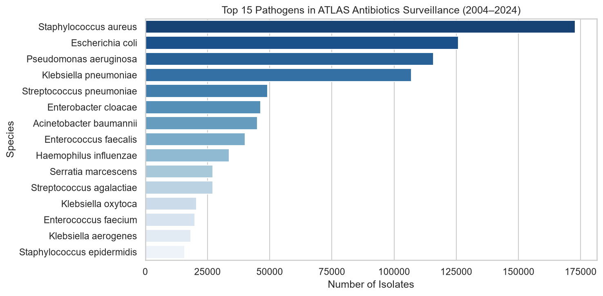
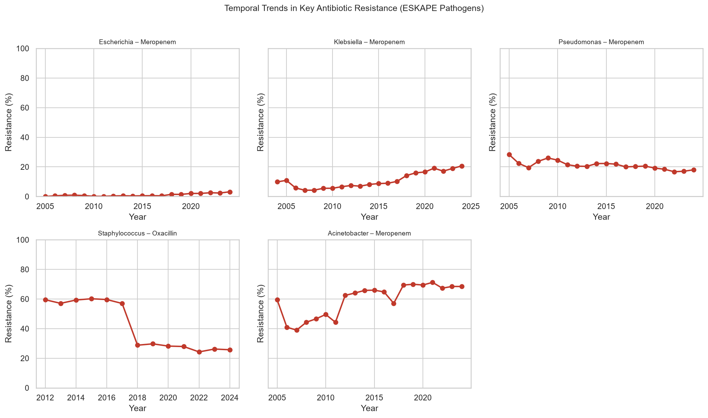
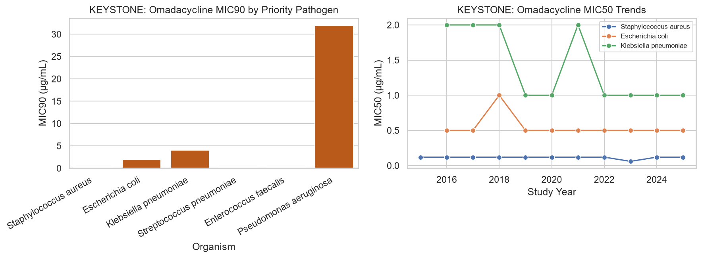
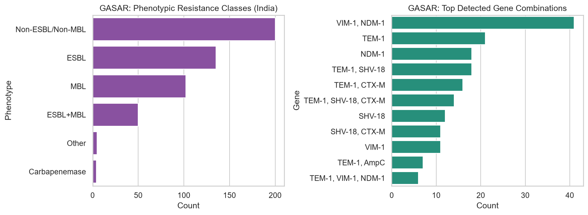

# SurveilAMR: AI-Enabled Surveillance Intelligence for Global Antimicrobial Resistance Trends

**2026 Vivli AMR Surveillance Data Challenge Submission**

Nana Safo Duker¹, Dr. Agnes Achiamaa Anane², Dr. Marwin Afari² | ¹GeneHus, Ghana | ²Ghana Health Service, Ghana

**Repository:** [https://github.com/Nana-Safo-Duker/Vivli-AMR-2026-Data-Challenge-SurveilAMR](https://github.com/Nana-Safo-Duker/Vivli-AMR-2026-Data-Challenge-SurveilAMR) | **Data Request ID:** 00013370 | **DOI:** [10.25934/PR00013370](https://doi.org/10.25934/PR00013370)

---

## Abstract

Industry surveillance data in the Vivli AMR Register remain underused for LMIC decision support. **SurveilAMR** provides a reproducible pipeline across four approved datasets—Pfizer ATLAS Antibiotics (1,011,168 isolates; 83 countries; 2004–2024), Paratek KEYSTONE (96,302; 2015–2025), Johnson & Johnson DREAM MDR-TB (5,928; 2011–2019), and Venus Remedies GASAR III (496; India, 2022–2023). We quantified ESKAPE spatiotemporal resistance, beta-lactamase/carbapenemase markers, bedaquiline MICs, and omadacycline potency. *K. pneumoniae* meropenem resistance rose from 4.2% (2007) to 20.7% (2024). African ATLAS isolates (n = 29,387) showed elevated *A. baumannii* meropenem resistance (75.9%). DREAM bedaquiline MICs remained low (median 0.03 µg/mL; Africa 0.06). GASAR revealed ESBL/MBL phenotypes and NDM/VIM co-carriage. Code, tables, and figures are openly available.

---

## Objectives

1. Quantify country/regional AMR trends for empiric therapy and guideline updates.
2. Characterize ESKAPE and priority Gram-negative pathogens against WHO-priority antibiotic classes.
3. Profile resistance mechanisms (CTX-M, KPC, NDM, OXA, SHV, TEM; GASAR gene/phenotype combinations).
4. Detect temporal early-warning signals for antimicrobial stewardship program (ASP) alerts.
5. Integrate ATLAS, KEYSTONE, DREAM, and GASAR for LMIC stewardship, including Ghana Health Service partners.

---

## Methods

**Data sources.** ATLAS_Antibiotics (Pfizer): metadata, MICs, S/I/R labels, and 23 gene markers. KEYSTONE (Paratek): omadacycline MICs. DREAM (J&J): MDR-TB bedaquiline MICs. GASAR III (Venus Remedies): Gram-negative phenotypic/genotypic combinations and polymyxin B MICs. Aggregates: [repository link](https://github.com/Nana-Safo-Duker/Vivli-AMR-2026-Data-Challenge-SurveilAMR).

**Preprocessing.** Standardized S/I/R labels; minimum ATLAS stratum sizes (n ≥ 20 year–species–drug; n ≥ 50 country–species); parsed MIC inequalities; normalized DREAM TB subtypes and GASAR phenotype buckets.

**Pipeline.** Python 3.10+ (Pandas, NumPy, SciPy, Matplotlib, Seaborn): chunked ATLAS EDA, resistance estimation, gene prevalence, MDR proxy (≥2 resistant classes), and supplementary summaries (`scripts/run_analysis.py`, `scripts/analyze_supplementary.py`, `scripts/generate_figures.py`). Methods follow 2025 Vivli VIT Grand Prize reproducibility practices.

**Limitations.** Surveillance sampling bias (NA/EU over-representation), incomplete ATLAS gene testing, heterogeneous DREAM subtypes, no patient-level outcomes.

---

## Results

**Table 1. SurveilAMR Vivli Datasets Analyzed**

| Dataset | Contributor | Isolates | Years | Geography |
|---------|-------------|----------|-------|-----------|
| ATLAS Antibiotics | Pfizer | 1,011,168 | 2004–2024 | 83 countries |
| KEYSTONE | Paratek | 96,302 | 2015–2025 | 20 countries |
| DREAM (MDR-TB) | Johnson & Johnson | 5,928 | 2011–2019 | 11 countries |
| GASAR Study III | Venus Remedies | 496 | 2022–2023 | India |

ATLAS dominant species: *S. aureus* (172,883), *E. coli* (125,878), *P. aeruginosa* (115,807), *K. pneumoniae* (106,946). African ATLAS: 29,387 isolates (Ghana 210).

**Figure 1.** Top 15 pathogens in ATLAS Antibiotics surveillance (2004–2024).

*K. pneumoniae* meropenem resistance increased from **4.2% (2007)** to **20.7% (2024)**; *E. coli* to **3.2% (2024)**; *A. baumannii* remained **65–71%**; *S. aureus* oxacillin resistance declined to **25.7% (2024)**.

**Figure 2.** Year-over-year resistance for priority antibiotic–pathogen pairs.

**Table 2. Selected Resistance Rates — Global vs African ATLAS (2024)**

| Pathogen | Antibiotic | Global | Africa |
|----------|------------|--------|--------|
| *K. pneumoniae* | Meropenem | 20.7% | 12.8% |
| *E. coli* | Meropenem | 3.2% | 1.4% |
| *A. baumannii* | Meropenem | 68.5% | 75.9% |
| *S. aureus* | Oxacillin | 25.7% | 31.0% |

**Figure 3.** Primary-antibiotic resistance: global latest year vs African ATLAS subset.

Hotspots included *A. baumannii* meropenem non-susceptibility (Ukraine 93.8%, Jordan 93.0%) and *K. pneumoniae* carbapenem resistance (Ukraine 60.9%, India 53.6%). Top ATLAS genes: CTX-M-1 (3.32%), TEM (2.88%), SHV (2.76%).

**Figure 4.** Beta-lactamase and carbapenemase gene detection (ATLAS).

KEYSTONE omadacycline retained potency against *S. aureus* (MIC90 0.25 µg/mL) and *S. pneumoniae* (0.12); DREAM bedaquiline median 0.03 µg/mL (Africa 0.06); GASAR showed ESBL/MBL phenotypes and VIM-1+NDM-1 co-detection (n=41).

**Figure 5.** KEYSTONE omadacycline MIC90 by pathogen and MIC50 trends.

**Figure 6.** DREAM bedaquiline MIC distributions by continent and year.

**Figure 7.** GASAR phenotypic classes and top gene combinations (India).

*Additional figures (country distribution, heatmaps, MDR proxy, EDA plots) are in `outputs/figures/` and the GitHub repository.*

---

## Impact of the Work

SurveilAMR converts restricted Vivli assets into **open stewardship intelligence** for Ghana Health Service and the 2026 challenge. Country- and pathogen-specific views support empiric therapy where cultures are delayed. Rising *K. pneumoniae* carbapenem resistance and African *A. baumannii* burden provide ASP triggers; KEYSTONE, DREAM, and GASAR summaries support novel-agent positioning, MDR-TB monitoring, and mechanism-aware prescribing. The [repository](https://github.com/Nana-Safo-Duker/Vivli-AMR-2026-Data-Challenge-SurveilAMR) provides chunked-analysis templates, processed CSVs, and figure scripts following 2025 VIT reproducibility standards. Future work: interactive dashboards and forecasting for African sentinel sites including Ghana.

---

## References

1. Naghavi M, Vollset SE, Ikuta KS, et al. Global burden of bacterial antimicrobial resistance 1990–2021: a systematic analysis with forecasts to 2050. *Lancet*. 2024;404:1199–1226.

2. World Health Organization. WHO bacterial priority pathogens list, 2024. Geneva: WHO; 2024.

3. Vivli AMR Register. 2026 Vivli AMR Surveillance Data Challenge. Available at: https://amr.vivli.org/tag/datachallenge/

4. Haryini SS, Karve S, Priya Doss CG, et al. Temporal links between ambient air pollutants and antifungal drug resistance in *Candida glabrata*. *Wellcome Open Res*. 2026. Code: https://github.com/Belindaharyini/Vivli-AMR-data-challenge-2025-VIT-

5. Pfizer Inc. ATLAS Global Antimicrobial Surveillance Program. Data via Vivli AMR Register (ATLAS_Antibiotics).

6. SurveilAMR Team. SurveilAMR: Vivli AMR 2026 Data Challenge Repository. 2026. https://github.com/Nana-Safo-Duker/Vivli-AMR-2026-Data-Challenge-SurveilAMR

7. Prestinaci F, Pezzotti P, Pantosti A. Antimicrobial resistance: a global multifaceted phenomenon. *Pathog Glob Health*. 2015;109(7):309–318.

8. Tadesse BT, Ashley EA, Ongarello S, et al. Antimicrobial resistance in Africa: a systematic review. *BMC Infect Dis*. 2017;17(1):616.

9. World Health Organization. WHO consolidated guidelines on tuberculosis. Module 4: treatment — drug-resistant tuberculosis treatment. Geneva: WHO; 2022.

10. Johnson & Johnson; Paratek Pharmaceuticals; Pfizer Inc.; Venus Remedies Limited. Vivli AMR Register industry surveillance datasets. Accessed via https://amr.vivli.org (Data Request 00013370).

---

> **Acknowledgement:** This publication is based on research using data from Johnson & Johnson, Paratek, Pfizer, Venus Remedies Limited, obtained through https://amr.vivli.org
